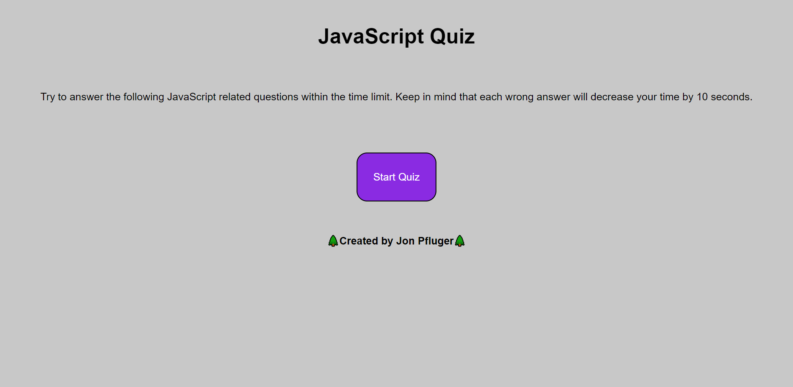

# JavaScript Quiz

I created this quiz to study the fundamentals of JavaScript. This is a timed exercise, and the time will decrease more for every wrong answer. The score will be displayed at the end.

## Screenshot

## Link

https://jonpfluger.github.io/javascript-quiz/